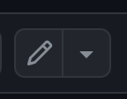
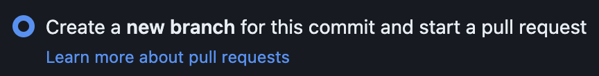

# morvern

This is a simple, static website with no database, CPanel, etc.

Our version of a database is the **[content folder](https://github.com/morvern-web/test/tree/main/src/content)**.

## Contributing

If you do not have a github account, create one, then let me know your username and I will add you to the approved contributors.

Find the file you wish to update in the content folder, and click the edit button in the top-right corner.

Make your edits to that file in the browser. You can copy/paste the formatting from an existing entry if you wish.

### Formatting entries

For **news** entries - The 'date' field represents the date that the news will go live on the site.

For **live** entries - The 'date' field represents the date of the event. The 'announced' field represents the date that the entry will go live on the site.

For each of these, you can set a specific time if you wish, e.g. setting "2024-10-17 09:00:00" will make that entry go live at 9am GMT on that date.

If it is set to be a date without a time, e.g. "2024-10-17", the entry will go live at midnight GMT on that date.

### Committing changes

Once you're finished editing the file, click the 'Commit changes' button.

In the following popup, select 'Create a new branch for this commit'.

Feel free to edit the message and description fields, though this is not necessary.

Click the 'Propose changes' button at the bottom of the popup.

Finally, on the follwing screen click the 'Create pull request' button.

That's it!

I will then review the changes and merge them into the main branch ready to be published.
